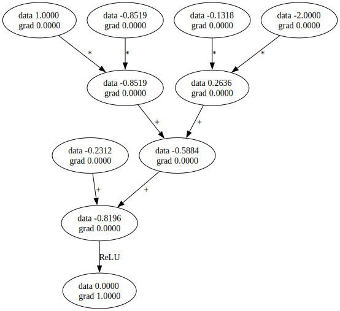

<div align="center">

## Micrograd
[]()
[]()
<br>


</div>

## ⇁  Welcome
This is a thesis project by [Alexander Berg](https://github.com/21st-centuryman) and [Jabez Otieno](https://github.com/Jakunot) to rewrite the [micrograd](https://github.com/karpathy/micrograd) framework by Andrej Karpathy to Rust. The purpose of our thesis is to discuss the properties of the Rust programming language and if they are suitable or necessary for large language models and at which stages they might or might not be applicable. This thesis is planned to be presented in late fall of 2024, until then we plan to work on this whenever school and life allow us.

## ⇁  Example usage
```rs
use micrograd::engine::Value;
let a = Value::from(-4.0);
let b = Value::from(2.0);
let c = a  + b;
let d = a * b + b.pow(3.0.into());
let c += c + Value::from(1.0);
let c += Value::from(1.0) + c + (-a);
let d += d * Value::from(2.0) + (b + a).relu();
let d += Value::from(3.0) * d + (b - a).relu();
let e = c - d;
let f = e.pow(2.0.into());
let g = f / Value::from(2.0);
let g += Value::from(10.0) / f;
println!("{:.4}", g.borrow().data); // prints 24.7041
g.backward();
println!("{:.4}", a.borrow().grad); // print 138.8338
println!("{:.4}", b.borrow().grad); // print 645.5773
```

## ⇁  Tracing / Visualization

We also implemented a draw_dot function that will act similarly to graphviz and digraph. This will allow us to visualize each node, showing both their data and gradient. An example below shows how to run it. Also `trace_graph.ipynb` shows how to achieve this using [evxcr jupyter kernel](https://github.com/evcxr/evcxr/blob/main/evcxr_jupyter/README.md)
```rust
use micrograd::engine::Value;
use micrograd::nn::Neuron;
let x = Value::from(1.0);
let y = (x * Value::from(2) + Value::from(1)).relu();
y.backward();
draw_dot(y);
```


## ⇁  Running tests
```console
cargo test
```
## ⇁  License
MIT
</div>
